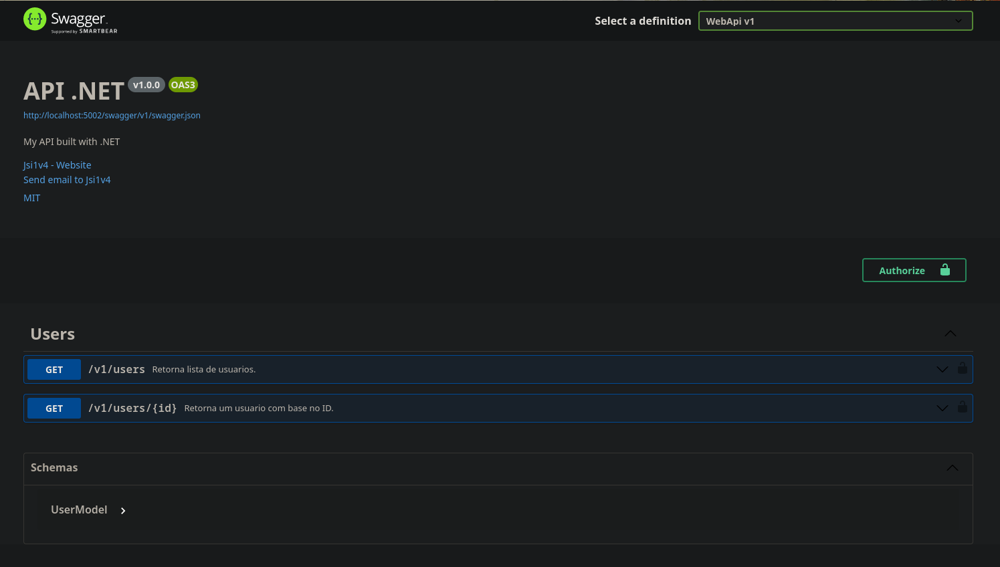

# API .NET

My API built with .NET, [take a look](https://api-csharp.josepaulo.dev/api/v1.0/welcome) 🖖.



## Sobre

Utilizei esta API para aplicar meus estudos da plataforma .NET. Com ela consigo criar usuarios, gerenciar perfis e criar analises e planejamento pessoais.

> Conto mais detalhes no [Front-end](https://github.com/jsi1v4/my-planning-app) e devops, arquitetura e docker compose [aqui](https://github.com/jsi1v4/devops) 🖖😎.

## Requisitos

- [.NET 8](https://dotnet.microsoft.com)

## Tecnologias utilizadas

O projeto foi desenvolvido utilizando as seguintes tecnologias:

- [.NET 8](https://dotnet.microsoft.com)
- [Npgsql](https://www.npgsql.org)
- [Dapper](https://github.com/DapperLib/Dapper)
- [Swagger](https://github.com/domaindrivendev/Swashbuckle.AspNetCore)

## Como baixar e executar o projeto

### Clonar o repo

```sh
git clone https://github.com/jsi1v4/api-csharp
```

### Instalar dependências

```sh
dotnet restore
```

### Executar em localhost

```sh
# run in http://localhost:5002
dotnet run --project src/WebApi/WebApi.csproj
```

> Documentação disponivel em [http://localhost:5002/swagger](http://localhost:5002/swagger)

### Buildar projeto

```sh
dotnet build --project src/WebApi/WebApi.csproj
```

[**Voltar ao inicio**](#api-net)

---

Keep calm and code on 🤘.
